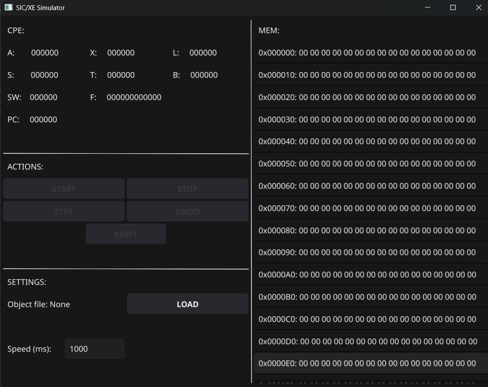

# SICSIM

SICSIM is a SIC/XE emulator written in Go. This project replicates the SIC/XE computer architecture.

## Features

- **SIC/XE Simulation:**  
  Emulates the SIC/XE architecture with support for all standard instructions except for floating point and system instructions.
- **Addressing Modes:**  
  Implements various addressing modes to accurately simulate the behavior of SIC/XE instructions.
- **File Operations:**  
  Supports file input/output.
- **Graphical User Interface (GUI):**  
  Provides a simple and intuitive GUI using Fyne for easier interaction with the simulator.

## 🖼 Screenshot

